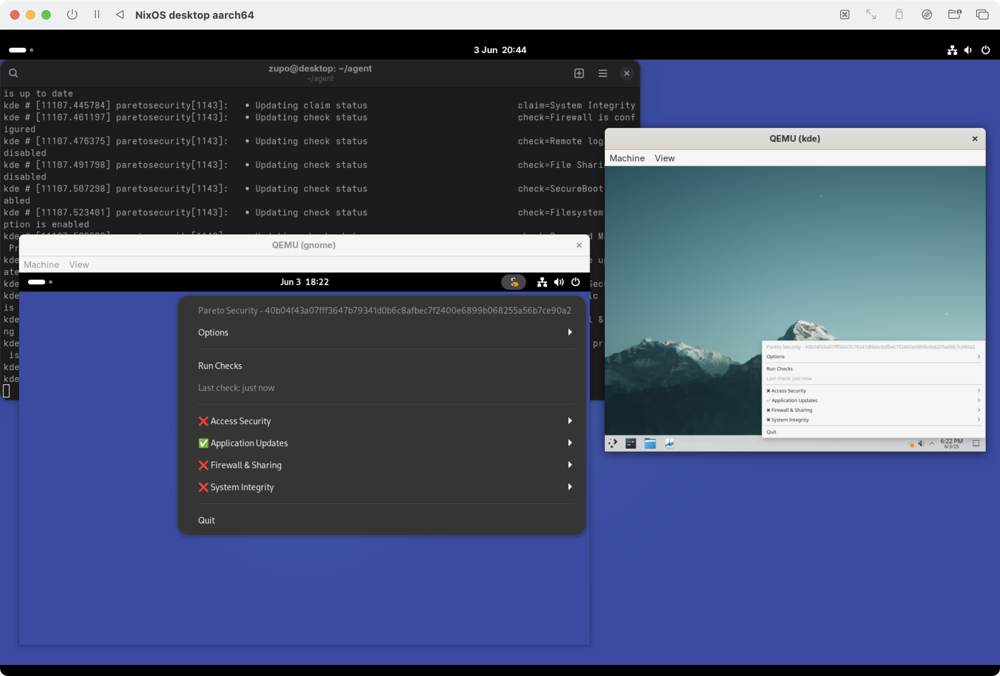

# Integration Tests

This directory contains integration tests for the Pareto Security Agent. These tests verify that the agent works correctly on various Linux distributions and system configurations.

## Available Tests

The following integration tests are available:

- **cli** - Tests command-line interface functionality
- **firewall** - Tests firewall configuration and rules
- **help** - Tests help command and documentation
- **luks** - Tests LUKS encryption checks
- **pwd-manager** - Tests password manager integration
- **screenlock** - Tests screen lock functionality
- **secureboot** - Tests secure boot checks
- **trayicon** - Tests system tray icon functionality
- **xfce** - Tests XFCE desktop environment integration
- **gnome** - Tests GNOME desktop environment integration
- **kde** - Tests KDE Plasma desktop environment integration

## Running Tests

On NixOS, you can run the tests with the following command:

```console
# Run a specific test
$ nix build .#checks.x86_64-linux.firewall
$ nix build .#checks.aarch64-linux.firewall

# Run desktop environment tests
$ nix build .#checks.x86_64-linux.gnome
$ nix build .#checks.x86_64-linux.kde
$ nix build .#checks.x86_64-linux.xfce

# Run all other tests
$ nix build .#checks.x86_64-linux.cli
$ nix build .#checks.x86_64-linux.help
$ nix build .#checks.x86_64-linux.luks
$ nix build .#checks.x86_64-linux.pwd-manager
$ nix build .#checks.x86_64-linux.screenlock
$ nix build .#checks.x86_64-linux.secureboot
$ nix build .#checks.x86_64-linux.trayicon
```

On macOS with nix-darwin and linux-builder enabled, you can run the tests with the following command:

```console
# Replace x86_64-linux with aarch64-darwin for Apple Silicon Macs
$ nix build .#checks.aarch64-darwin.firewall
$ nix build .#checks.aarch64-darwin.gnome
$ nix build .#checks.aarch64-darwin.kde
$ nix build .#checks.aarch64-darwin.xfce
```

## Memory Requirements

Desktop environment tests have different memory requirements:
- **XFCE**: 1.5GB (lightweight desktop)
- **GNOME**: 2GB (requires more resources for Wayland/GNOME Shell)
- **KDE**: 2GB (Plasma desktop needs significant memory)
- **Dashboard node**: 512MB (minimal mock server)

If you encounter segmentation faults or out-of-memory errors, consider:
1. Running tests individually rather than in parallel
2. Closing other applications to free up memory
3. Increasing system swap space
4. Using a machine with more RAM (minimum 8GB recommended for desktop tests)

## Debugging Tests

Appending `.driverInteractive` to the test name will build the test runner with interactive mode enabled. This allows you to debug the test by SSHing into the test VM.

```console
$ nix build .#checks.aarch64-darwin.firewall.driverInteractive
./result/bin/nixos-test-driver
>>> start_all()
>>> machine.shell_interact()
```

For a nicer shell, you can SSH into the test VM via a testing backdoor. This is useful for debugging or interacting with the test environment. The first testing node will be accessible via `vsock/3`, the second via `vsock/4`, and so on:

```
$ ssh -o User=root vsock/3
$ ssh -o User=root vsock/4
$ ssh -o User=root vsock/5
...
```

This assumes your test file has the `interactive.sshBackdoor.enable = true;` line.
Read more about the SSH backdoor in the [NixOS manual](https://nixos.org/manual/nixos/stable/#sec-nixos-test-ssh-access).


## Seeing UI changes

A quick way to see the changes you made to the UI is to build the test runner in
`screenlock.nix` and run it on a NixOS (VM) machine, so that QEMU can display the UI.

```console
$ nix build .#checks.x86_64-linux.screenlock.driverInteractive
$ ./result/bin/nixos-test-driver
>>> start_all()
```

A NixOS VM, managed by UTM on a Mac, running the `screenlock` test VMs:



